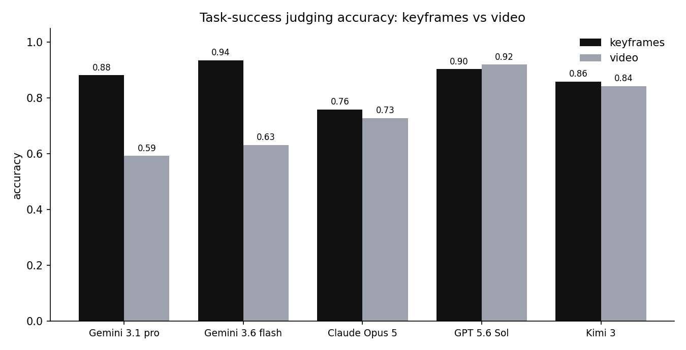
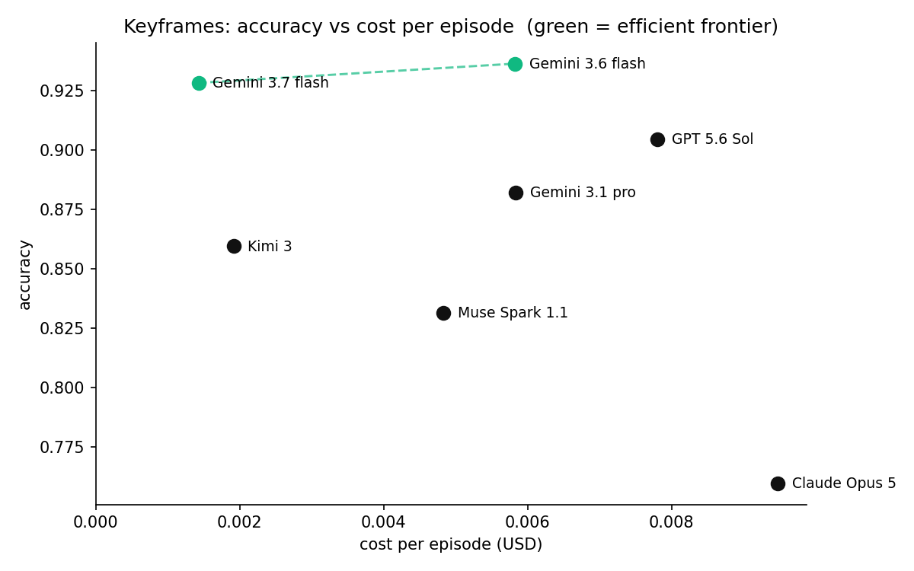

# robot-eval-bench

Benchmarking task-success evaluation for VLMs: can a vision-language model tell
whether a robot actually *did the task*?

The hardest question in robot learning isn't "can the policy move." It's "did it
actually do the thing." A policy can pick up a cup with picture-perfect motion and
still put it down in the wrong spot, and if your evaluation can't tell those two
runs apart, every number downstream is fiction. Before you can trust a policy, you
have to trust the thing grading it.

This repo is the open dataset and code behind that question. We put seven frontier
models to work as robot-policy judges, scoring whether an episode accomplished its
task from **keyframes** and from **video**, across 16 open-source LeRobot datasets.
Everything needed to reproduce the numbers, and to benchmark a new model against
the same ground truth, is here.

Read the write-up: **[kiteml.com/blog/robot-eval-bench](https://kiteml.com/blog/robot-eval-bench)** · Built by [Kite](https://kiteml.com).

## Results

Accuracy is the fraction of episodes the judge labeled correctly (abstentions
count as incorrect, since the judge was asked and didn't answer).

| Judge | Keyframes | Video |
| --- | --- | --- |
| Gemini 3.1 pro | 0.88 | 0.59 |
| Gemini 3.6 flash | **0.94** | 0.63 |
| Gemini 3.7 flash | 0.93 | 0.89 |
| Claude Opus 5 | 0.76 | 0.73 |
| GPT 5.6 Sol | 0.90 | **0.92** |
| Kimi 3 | 0.86 | 0.84 |
| Muse Spark 1.1 | 0.83 | 0.87 |

Cost per episode (USD), macro-averaged across datasets:

| Judge | Keyframes | Video |
| --- | --- | --- |
| Gemini 3.1 pro | $0.0058 | $0.0005 |
| Gemini 3.6 flash | $0.0058 | $0.0008 |
| Gemini 3.7 flash | $0.0014 | $0.0043 |
| Claude Opus 5 | $0.0095 | $0.0551 |
| GPT 5.6 Sol | $0.0078 | $0.0538 |
| Kimi 3 | $0.0019 | $0.0081 |
| Muse Spark 1.1 | $0.0048 | $0.0086 |




### Two things flip depending on the model

**Accuracy.** More frames should mean better judgment, so video should beat
keyframes everywhere. It doesn't, and which way it breaks depends on the model. The
reasoning models (GPT-5.6 Sol, Kimi 3, Claude Opus 5, and Meta's Muse Spark 1.1)
hold up or improve on video. The early Gemini judges were excellent on keyframes
and then cratered on the full clip (3.6 flash dropped from 0.94 to 0.63), but
**Gemini 3.7 flash closes that gap**: it holds video at 0.89 while keeping keyframes
at 0.93, which makes it a co-leader on average (0.91, tied with GPT-5.6 Sol) at
flash-tier cost. The right approach is still a property of the judge you picked,
not a universal law.

**Cost.** For Gemini, video is the cheap option: one natively-encoded clip costs
almost nothing, while a few full-resolution keyframes cost about ten times more.
For the frame-sampling models it flips, because they read video as ~16 separate
frames, so Opus and GPT jump 5-7x from keyframes to video. Kimi 3 is the cheapest
reasoning judge either way, and sits with Gemini 3.6 Flash on the efficient
frontier of the keyframes cost/accuracy trade-off.

## What's in here

```
data/
  episodes.jsonl      one row per (dataset x model x approach x episode) judgment
  results.json        per (model, approach) accuracy + cost + per-dataset breakdown
  ground_truth.json   the reproducible labeled set: per-episode labels + the config
                      (dataset, seed, negatives) that regenerates it
  datasets.json       the 16 datasets, task strings, and per-dataset config
src/
  selection.py        episode selection + how negatives are synthesized (+ frame sampling)
  cost.py             the token-based cost model and the price table
  judges.py           the shared prompt and exactly how each model was called
  evaluate.py         scoring, and the entry point for adding a new model
  charts.py           regenerates the figures from data/results.json
charts/               the generated figures
```

## Reproduce it

No API keys or dataset downloads needed to check the headline numbers, they're
recomputed from the shipped per-episode predictions:

```bash
python src/evaluate.py          # re-scores every model from data/episodes.jsonl
pip install matplotlib
python src/charts.py            # regenerates the figures
```

## The details

**Each episode evaluated** lives in [`data/episodes.jsonl`](data/episodes.jsonl):
its dataset, the judge and approach, the ground-truth label, the source
(`demo` success or `synthetic` negative), the failure mode for negatives, the
model's prediction, whether it was correct, and its confidence and latency.

> Note: `episodes.jsonl` holds the per-episode judgments for the original five
> judges. The two newest models (Gemini 3.7 flash and Muse Spark 1.1) are
> summarized in [`data/results.json`](data/results.json) (aggregate accuracy and
> cost, per dataset); their per-episode judgments will be backfilled here.

**How episodes are selected** is in [`src/selection.py`](src/selection.py). The
open-source episodes uploaded to HuggingFace are almost entirely *success*
examples, so we build a class-balanced set: each demo is a success, and one matched
negative is synthesized per demo by corrupting it (`truncate`, `mismatch`,
`shuffle`, `reverse`). Each negative carries its failure mode. The exact set is
determined by `(dataset, seed, negatives)`, stored per dataset in
[`data/ground_truth.json`](data/ground_truth.json), so it's fully reproducible.

**How cost is calculated** is in [`src/cost.py`](src/cost.py). Every call records
its input/output tokens; dollar cost comes from an editable price table after the
fact. The per-episode figure divides total cost by *every* episode the judge was
called on, abstentions included, then macro-averages across datasets. Native-video
Gemini runs predate token logging, so they fall back to a recorded `cost_usd`.

**How each model was called** is documented in [`src/judges.py`](src/judges.py):
the identical strict-JSON prompt, tolerant verdict parsing, and a `MODELS` table
with each model's ID, provider, API, whether it takes native video, its
max-output-tokens field, and whether it accepts a custom temperature (reasoning
models don't). Keyframes = 4 evenly-spaced stills (first and last included); video
= a native MP4 for Gemini, ~16 dense frames for everyone else.

**A note on the ground truth.** Some LeRobot labels are wrong. `aloha_static_towel`
ships a description about cleaning up a spilled liquid that never appears in the
footage, when the robot is really placing a paper towel next to a tipped-over can.
Grade a judge against the wrong task and it fails every episode, so a handful of
task strings were corrected before benchmarking. Corrections are flagged with
`task_overridden` in [`data/datasets.json`](data/datasets.json).

## Add your own model

The ground truth, episode selection, and scoring are all model-agnostic, so a new
model grades against exactly the same episodes and labels every other model saw:

1. Implement `judges.Judge.judge(task, frames, video_path=...)` for your model
   (see the `MODELS` table for the calling conventions of the existing five).
2. For each dataset in `data/ground_truth.json`, reconstruct the labeled set with
   `selection.build_labeled_set(demos, negatives=cfg["negatives"], seed=cfg["seed"])`
   using that dataset's `config`. Load the demos with any LeRobot loader.
3. Encode per approach (`episode.sample_frames(4)` for keyframes; native MP4 or 16
   frames for video), call your judge, and `evaluate.score(predictions, labels)`.

### Registered but not yet run (Sep 2026)

Five new frontier judges are registered in the `MODELS` table and price list, and
grade the identical ground truth, but haven't been benchmarked yet — their rows land
in the results tables once a run completes:

| Judge | Model ID | Provider | Native video | Price (in / out per 1M) |
| --- | --- | --- | --- | --- |
| Gemini 3.8 flash | `gemini-3.8-flash` | Google | yes | $0.75 / $3.75 |
| GPT-6 Astra | `gpt-6-astra` | OpenAI | no (dense frames) | $10 / $50 |
| Muse Spark 1.3 | `muse-spark-1.3` | Meta | no (dense frames) | $1.25 / $4.25 |
| Claude Fable 5.1 | `claude-fable-5-1` | Anthropic | no (dense frames) | $10 / $50 |
| Claude Opus 5.5 | `claude-opus-5-5` | Anthropic | no (dense frames) | $4 / $20 |

## License

MIT, see [LICENSE](LICENSE). The underlying episodes are from the
[LeRobot](https://huggingface.co/lerobot) datasets on HuggingFace under their
respective licenses; this repo ships derived labels and judgments, not raw
episode video.
